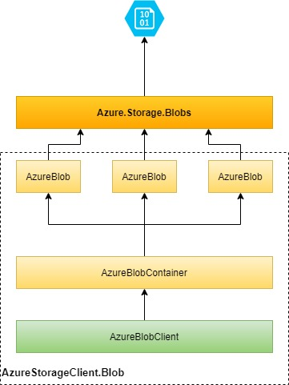

# AzureStorageClient

##### What does it do?

This repository contains *AzureStorageClient.Blob* and *AzureStorageClient.Table* which are clients to Azure Storage.

##### Why is it useful?
The aim of the package is to provide simple, easy-to-use and intuitive clients to popular storage, while letting developer focus on developing their apps rather than navigating through pile of documentation to integrate with this service.

Package exposes RepositoryPattern through set of interfaces such as `IAzureBlobClient` and `IAzureTableClient` which allows to perform CRUD operations over data.
 

---
## Prerequisites

One of the below:
- .Net Core v 2.0 or higher
- .Net 5 or higher
- .Net Framework 4.6.1 (4.7.2 suggested) or higher

## Getting started

#### 1. AzureStorageClient.Blob Client

	
   - register *AzureBlobClient* in IoC: `services.AddAzureBlobClient(Configuration);`
   - (optionally) use method `applicationBuilder.InitializeAzureBlobClient();` to initialize blob container on application start up
   - add to `appsettings.json` section: 
		```
		"AzureBlobClientSettings": {
			"ConnectionString": "",
			"ContainerName": ""
		},
		```
   - reference `IAzureBlobClient`   

#### 2. AzureStorageClient.Table Client

   - register *AzureTableClient* in IoC: `services.AddAzureTableClient(Configuration);`
   - add to `appsettings.json` section: 
		```
		"AzureTableClientSettings": {
			"ConnectionString": ""
		}
		```
   - reference `IAzureTableClient`

#### AzureStorageClient.Blob dependency diagram



## Roadmap
- support for multiple containers within same AzureBlobClient
- lock blob while upserting content
- use AsyncStream to stream content of large blob folder
- performance tests
- add permission functionality around blobs (separate package)
- create hangfire/background scheduler with TableStorage

## Contribution
If you would like to report an issue, open pull request, suggest new feature or just improvement, you are most welcome. 

## License
AzureStorageClient is licensed under The MIT License (MIT). Basically, this license grants you the right to use AzureStorageClient in any way you see fit. See LICENSE for more info.

The purpose of the license is to make it easy for everyone to use AzureStorageClient and its accompanying integration libraries.

---
## Integration tests
- (optional) launch *Microsoft Azure Storage Emulator*
- Configure *appsettings.Development.json*
- Lists integration tests: `dotnet test .\Tests\AzureStorageClient.IntegrationTests\ --configuration {Debug|Release} --framework netcoreapp3.1 --list-tests`
- Run integration tests: `dotnet test .\Tests\AzureStorageClient.IntegrationTests\ --configuration {Debug|Release} --framework netcoreapp3.1 --logger trx --results-directory ./IntegrationTests/Results/`